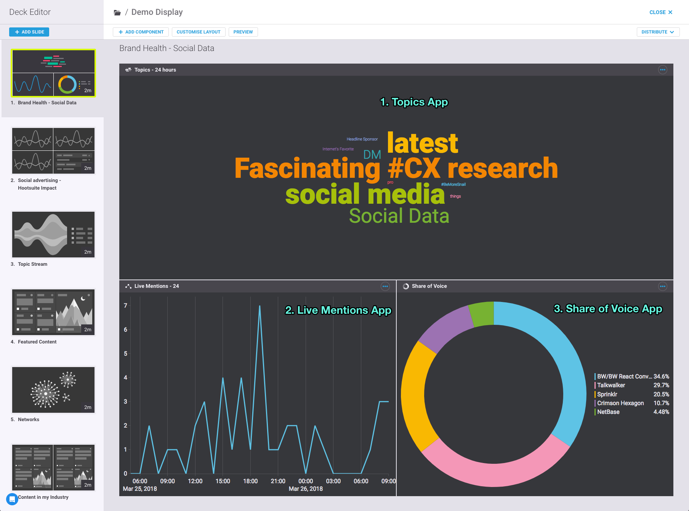
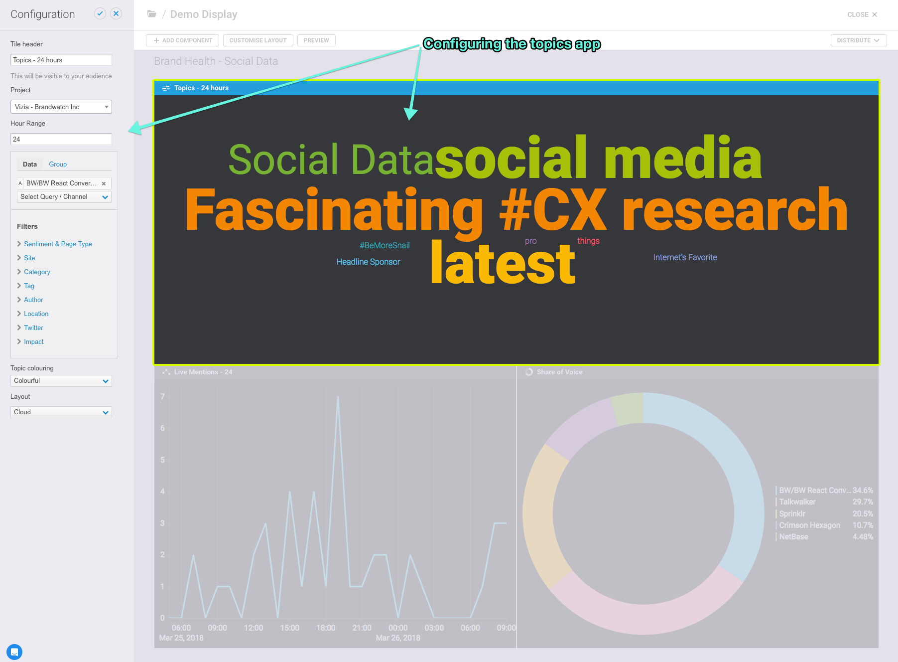

# Introduction

Vizia for Developers is a collection of JavaScript modules that allow for
rapid creation of `Apps` for [Vizia](https://www.brandwatch.com/vizia).

## Prerequisites

All of the modules in the Vizia for Developers ecosystem are written in JavaScript. It is expected that developers building applications for Vizia are comfortable with the language itself, as well as the `NodeJS` platform and associated tooling such as `npm`.

It's recommended that you develop on the latest stable NodeJS version, or at the very least >= 8.x.

You can use the excellent [Node Version Manager](https://github.com/creationix/nvm) to switch between NodeJS versions if need be.

## What is an App?

Vizia apps are self-contained JavaScript applications that display visualisations. They are configured by users via Vizia's admin interface, then loaded into slides on Vizia decks. Each app is loaded into its own sandboxed iframe, and is executed wholly in the browser.

The images below show a Deck being edited in Vizia admin

As an app developer, you will create the visualisation code, using both the modules made available in the Vizia for Developers ecosystem, as well as your own code. The Vizia team will work with you to create the admin interface for your app. As you work through this documentation, you will learn about the key concepts of building an app, as well as the tooling that is available for you to run and test your code.

## Anatomy of an App

A Vizia `App` can be thought of as one or more data sources, supplying
data into a visualisation of some kind (a chart, a table, a map, etc.). The underlying ethos of the Vizia for Developers ecosystem is that these building blocks can be expressed as discrete units of code (ie JavaScript modules). To this end, we have grouped the modules into `Sources`, `Transforms` and
`Destinations`.

A `Source` is a module that emits data. Typically in real-world use, a source will perform one or more api requests over HTTP, but it can be anything that emits data. The most popular use case for developers coming to the Framework is to get their own data into Vizia, and to do this, they'll need to create a custom source.

A `Destination` is a module that data ultimately ends up in. In real-world use, this is normally a module that displays data in the DOM, for example a chart, a table, etc. In most cases, [the Destinations available out of the box](destinations/readme.md) will cover your needs.

Given that each `Source` will most likely emit data in a unique format, and that each `Destination` will expect data in another, often unique, format, we introduce the concept of `Transforms` which are simple modules that receive data, manipulate it into different forms, and pass it on.

Developers are provided with a framework that allows for composition of `Sources`, `Transforms` and `Destinations` into fully-fledged `Apps` for Vizia. This module is named `Bundle`.

Let's create our first App soon, but first let's ensure that we have our tooling [set up](getting-started.md)
